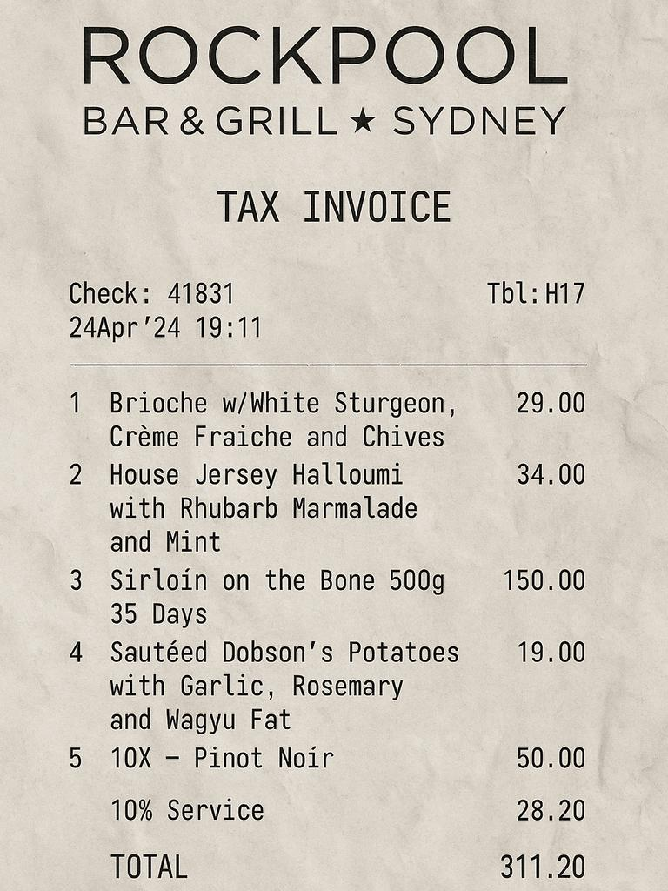
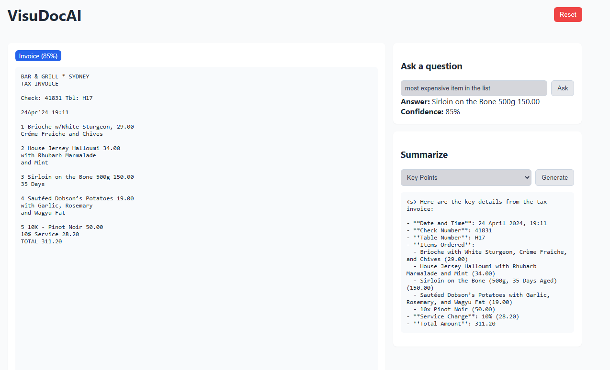

# VisuDocAI MVP

Full-stack AI-powered document analysis web application.

## Tech Stack
- Backend: Python Flask, Tesseract OCR (pytesseract), pdf2image, Pillow, OpenRouter LLM API
- Frontend: React 18, Axios, react-dropzone, Webpack

## Prerequisites (Windows)
- Python 3.10+ (recommended)
- Node.js 18+
- Tesseract OCR installed (e.g., `C:\\Program Files\\Tesseract-OCR\\tesseract.exe`)
- OpenRouter API key

## Setup

### 1) Backend
```
cd visudocai\\backend
python -m venv venv
venv\\Scripts\\activate
pip install -r requirements.txt
copy .env.example .env
# Edit .env and set OPENROUTER_API_KEY and OR_* models (defaults are auto)
# Optionally set TESSERACT_CMD if not on PATH
```

Run the API:
```
venv\\Scripts\\activate
python app.py
```
This starts on http://localhost:5000

### 2) Frontend
```
cd visudocai\\frontend
npm install
npm start
```
The dev server opens http://localhost:3000. The frontend calls the backend at http://localhost:5000/api.

for sample input


Sample output


## Notes
- Supported uploads: PDF, PNG, JPG (max 16MB by default)
- First LLM call may be slow depending on provider latency.
- OCR quality depends on input quality; scanning at 300 DPI recommended.

## Troubleshooting
- Tesseract not found: set TESSERACT_CMD in backend/.env
- PDF to image fails on Windows: set POPPLER_PATH to the `bin` folder of Poppler
- CORS issues: dev server proxies /api; ensure backend runs on 5000

## Scripts
- Backend: `python app.py`
- Frontend: `npm start`

